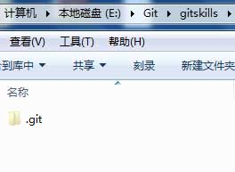
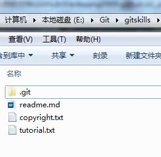
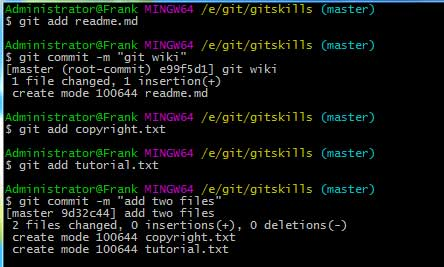
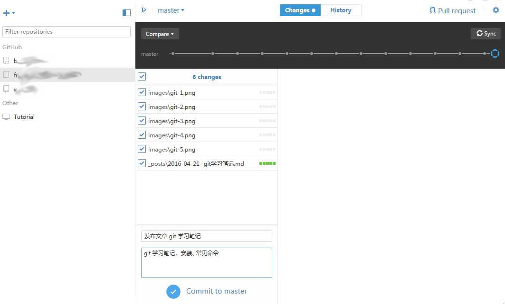

#### 方式一： msysgit

##### Step 1: 下载并安装msysgit
[msysgit](https://git-for-windows.github.io) 是Windows版的Git。下载，然后按默认选项安装即可。安装完成后，在开始菜单里找到“ Git ”->“ Git Bash ”，点击会弹出一个命令行窗口，说明Git安装成功。

##### Step 2: 设置用户名

在命令行输入以下命令

	$ git config --global user.name "Your Name"
	$ git config --global user.email "email@example.com"

**注意**： git config命令的`--global`参数，用了这个参数，表示你这台电脑上所有的Git仓库都会使用这个配置，当然也可以对某个仓库指定不同的用户名和Email地址。

##### Step 3: 创建版本库
1.选择一个合适的地方，创建一个空目录：

	$ mkdir  gitskills  // 创建一个名gitskills的目录
	$ cd   gitskills    // 切换gitskills目录
	$ pwd           //pwd 命令用于显示当前目录
    $ git init      //初始化Git仓库，当前目录中会多了一个.git目录（默认是隐藏的）

**注意**：为避免莫名其妙地报错，请确保目录名（包括父目录）不包含 **中文**。

##### Step 4: 把文件添加到版本库
在刚刚创建的目录(比如gitskills)下新建文件，或者从其他地方拷贝文件到该目录下。

	$ git add readme.md  //新增一个readme.md文件
	$ git commit -m "提交时的附加信息"  //把文件提交到仓库,并附上相关的说明文字（用引号括起来）
**注意**： 每次修改文件，都需要先add到暂存区，然后才能commit到仓库。可以add一个文件之后commit，也可以add多个文件，然后一起commit。

#### 其他常见命令：
1.  查看状态 : `git status`     
2.  推送到远程库： `git remote add origin git@github.com: 具体远程库的名称` 
3.  查看difference: `git diff readme.md `
4.  查看历史记录： `git log` 或者 `git log --pretty=oneline`。
你会看到一大串类似`commit: 8a56b4...ba53c1e50`十六进制字符串，它是版本号commit id， 回退时会用到。
5.  版本回退： 仅退到上一个版本可使用命令 `git reset --hard HEAD^`； 如果版本比较多，可以先 `git log` 找到对应的版本号commit_id，  然后使用命令 `git reset --hard commit_id`（版本号可以不用写全，git会自动查找匹配的）
6.  查看命令历史： ` git reflog`， 如果回退之后又后悔了，而且已经关了Git，那就使用 ` git reflog`，找到对应的commit，以便回到未来的哪个版本。

### 方式二： 使用GiHub提供的GitHub for Windows
在window平台下使用Git的最简单的方式是使用GitHub网站提供的[GitHub for Windows](https://desktop.github.com/)。优点是直接图形化的操作界面，完全不用记命令。

