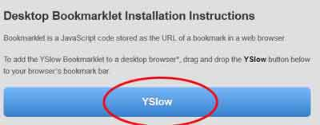
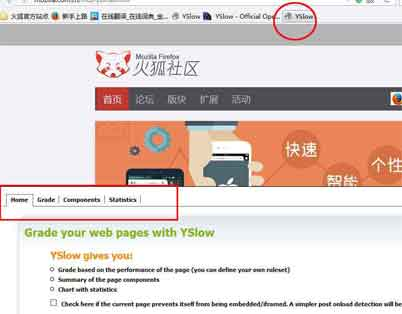

#### YSlow是什么？
YSlow是Yahoo发布的一款网页性能分析工具，它是基于FireFox的插件，最早只支持Firefox浏览器。使用前需要先安装另外一个插件——Firebug才能正常使用。

#### YSlow能做什么？
YSlow可以对网站的页面进行分析，并告诉你为了提高网站性能，如何基于某些规则而进行优化。YSlow可以分析任何网站，并为每一个规则产生一个整体报告，如果页面可以进行优化，则YSlow会列出具体的修改意见

#### 适用性
[YSlow官网](http://yslow.org/)显示可以支持Firefox、Chrome、Opera、Safari四种浏览器。

可事实上，YSlow在Firefox浏览器早已不能正常使用。经本人测试，确实不能像以往一样正常使用了。按F12出来Firebug虽然能够看到YSlow，但是点击任何位置都是没有反应的。这是因为Firefox升级后，出现不兼容的问题，而YSlow的开发者并没有更新。

来看看[Firefox里YSlow的评论: Not Working](https://addons.mozilla.org/en-US/firefox/addon/yslow/)

再来看看GitHub上的评论:[Not working with Firefox 44.0.2 ](https://github.com/marcelduran/yslow/issues)

#### 真的不能用了吗？
非也。

解决方法也很简单：

1.点击[YSlow官网](http://yslow.org/)右上角的 YSlow for Mobile/Bookmarklet 图标或者availability下面的 Mobile/Bookmarklet，将会跳转到另一页。

2.拉倒页面底部，那里有一个大大的YSlow图标，把它直接拉倒火狐浏览器的标签栏，会在标签栏保存一个图标。

3.当你要分析网页的性能的时候，不再像以前那样按F12出来Firebug就能使用YSlow, 而是打开网页，直接点击一下标签栏的那个图标,就会弹出来YSlow的界面.

我们能够看到的只有Home|Grade|Components|Statistics四个选项了，虽然比以前少了一个强大的tools，毕竟还是能够凑合着用。

