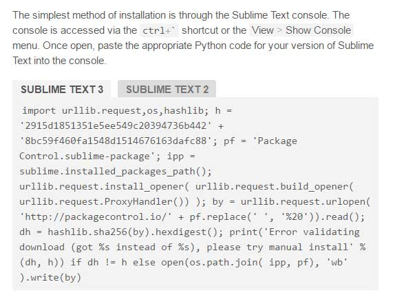
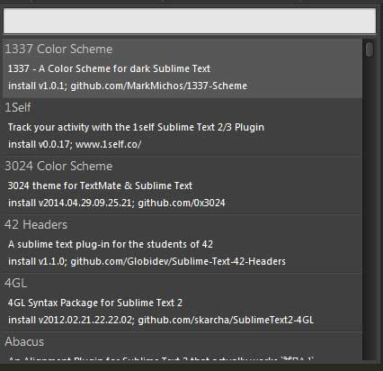

### Sublime Text 新手指南
自从我的代码编辑器改为[Sublime Text](https://www.sublimetext.com/)之后，写代码的效率明显高了许多。最近，我开始尝试着给身边的朋友推荐这款编辑器。当然，编辑器只不过是一个工具，能够提高自己的工作效率就是好的。

####  一、为什么要推荐Sublime Text?
1.跨平台；

2.轻量级，可拓展：有大量插件可由用户自行选择安装(首推Emmet和汉化插件ChineseLocalization)。

3.支持几乎所有的主流编程语言的语法高亮显示；

4.代码自动补全，支持代码段（Code Snippet）；

5.右上角的minimap: 用来查看标注、快速拖动、迅速定位；

6.快速跳转到不同的文件/方法/函数：支持模糊匹配；

7.快速切换Tab与space；

8.格式化代码；

####  二、如何安装Sublime Text以及下载管理插件？
1.下载安装包：Sublime Text官网地址：[https://www.sublimetext.com/](https://www.sublimetext.com/) 

根据自己的系统选择对应的安装包下载并安装。目前稳定版本为Sublime Text 3;

2.安装Package Control: Package Control 官网安装地址：[https://packagecontrol.io/installation](https://packagecontrol.io/installation)

下载插件之前需要先安装Package Control，它是用来管理和下载插件的控制组件。

1）使用快键键 ` ctrl+` `或者 View > Show Console 菜单打开控制台，然后，然后回车让它安装。

2）根据Sublime Text的版本选择复制对应的版本代码；

3）黏贴到控制台输入框里，按Enter键，插件管理包就进入正在下载安装的状态（可能需要一点时间）；

3.自定义安装各种插件：在 Package Control官网地址：[https://packagecontrol.io/](https://packagecontrol.io/)

可以看到各种插件以及它的下载量排名，找到自己感兴趣的，下载下来试用。

下载安装方法如下： (windows平台)

1）按下 ` Ctrl+Shift+P ` 调出命令面板，输入install， 调出 Install Package 选项并回车，出来这样的画面，

2）然后输入自己想要下载的插件名称，比如: HTML Extended

3）下载安装完成后会弹出类似这样的文件，说明已经成功安装该插件。

或者在左下角提示成功安装：

#### 三、推荐几个好用的插件：
1.ChineseLocalization汉化插件。

2.Emmet：通过简单的命令直接生成一大段代码。

3.JsFormat：格式化js代码。可以还原别人网站被压缩过难以阅读的js代码。

4.ConvertToUTF8(转换成utf-8格式): 默认情况下，gbk编码格式的中文会变成乱码，这个插件可以实现自动转换。

5.HTMLBeautify：格式化HTML。

6.Hasher:符号转义。

7.TrailingSpaces：多余空格标记。

#### 四、常用的一些快捷键（windows平台下）：
1.Ctrl + Shift + N 新建窗口；Ctrl + W 关闭该窗口。

2.Ctrl + N 新建标签；Ctrl + W 关闭当前标签；Ctrl + Shift + T 恢复刚刚关闭的标签。

3.Alt + Shift + 2 左右分屏； Alt + Shift + 8  上下分屏；Alt + Shift + 5  上下左右分为四屏。Ctrl + 数字键 跳转到指定屏，使用Ctrl + Shift + 数字键将当前屏移动到指定。ctrl+ 1 变回一屏显示。

4.F11 切换普通全屏; Shift + F11 切换无干扰全屏。

5.Ctrl + P 会列出当前打开的所有文件，点击某个文件可以快速跳转；

6.Ctrl + R 对于md文件，会列出大纲。

7.Ctrl + F 调出搜索框进行搜索；Ctrl + H 替换

8.Ctrl + J 把选中区域合并为一行；Ctrl + Shift + L 可以将当前选中区域打散，然后进行同时编辑：

9.多行游标（可同时编辑多行代码）：Ctrl + D 选择当前光标所在的词并高亮该词所有出现的位置，再次Ctrl + D选择该词出现的下一个位置，在多重选词的过程中，使用Ctrl + K 进行跳过，使用Ctrl + U 进行回退，使用Esc退出多重编辑。

10.Ctrl + Enter 在当前行下面新增一行然后跳至该行；Ctrl + Shift + Enter 在当前行上面增加一行并跳至该行。

11.Ctrl + E 自动生成代码片段（安装Emmet插件之后）。

12.Ctrl + shift + D 在下一行复制当前行内容，并跳至该行。

