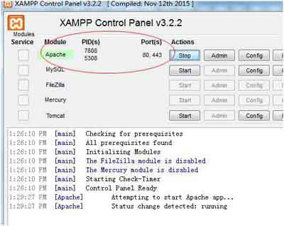
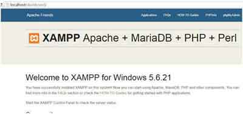
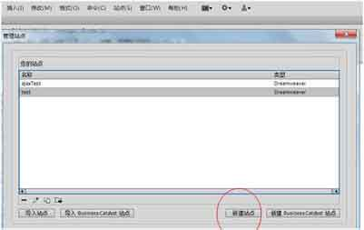
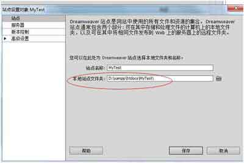
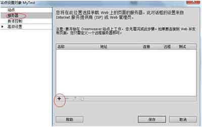
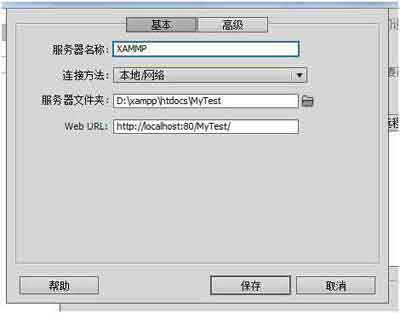

当我们开发的网站只包含静态 HTML、CSS 和 JavaScript，不需要测试服务器即可在在浏览器中预览它们。但更多的时候，我们的网站使用 ASP 或 PHP 等服务器端技术时，就需要部署能够处理动态代码并将它转换为可在浏览器中显示的测试服务器。那么，如何来部署呢？

#### 第一步：下载并安装建站集成软件包XAMPP。
XAMPP是一个易于安装的Apache发行版，其中包含MariaDB、PHP和Perl。仅仅需要下载并启动安装程序。[官网下载地址：https://www.apachefriends.org/download.html](https://www.apachefriends.org/download.html)

#### 第二步：启动XAMPP。
在XAMPP控制面板的我们可以看到各项服务及其状态。
点击”start”启动Apache服务器, 见截图

启动成功后，会显示默认的端口号80, 见截图

如果启动失败，提示端口被占用的话，则可以点击”Config”来修改配置文件”httpd.conf”中的监听端口号，比如改成`Listen 8080`。之后再点击”start”启动Apache。

#### 第三步：在浏览器测试
打开浏览器，输入  `localhost` (默认端口号80可以省略。如果之前修改了端口号，则输入相应的端口号，如`localhost:8080`)。

成功启动服务器的话，会显示一个欢迎页面，见下图：

#### 第四步：在Dreaweaver中设置站点

站点--- >管理站点--- >新建站点

需要注意的是：本地站点文件夹应该选择XAMPP安装路径下的 **htdocs** 文件夹，在该文件夹下可以新建一个文件夹并命名，比如MyTest。

设置站点的服务器：

在“基本”选项卡中选择后者修改以下内容：

1. 连接方式：本地网络

2. 服务器文件夹：D:\xampp\htdocs\MyTest（与前面选择的站点文件夹保持一致 ）

3. Web URL: http://localhost:80/MyTest/ (注意端口号与之前设置的保持一致)

在“高级”选项卡的 **测试服务器模型** 中选择 **PHP MySQL**。 

去掉默认的**远程**，并且勾选**测试**，再点击“保存”，这个站点作为本地Web服务器就配置好了。

